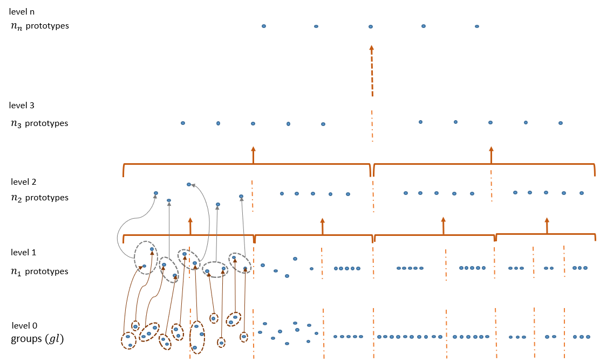
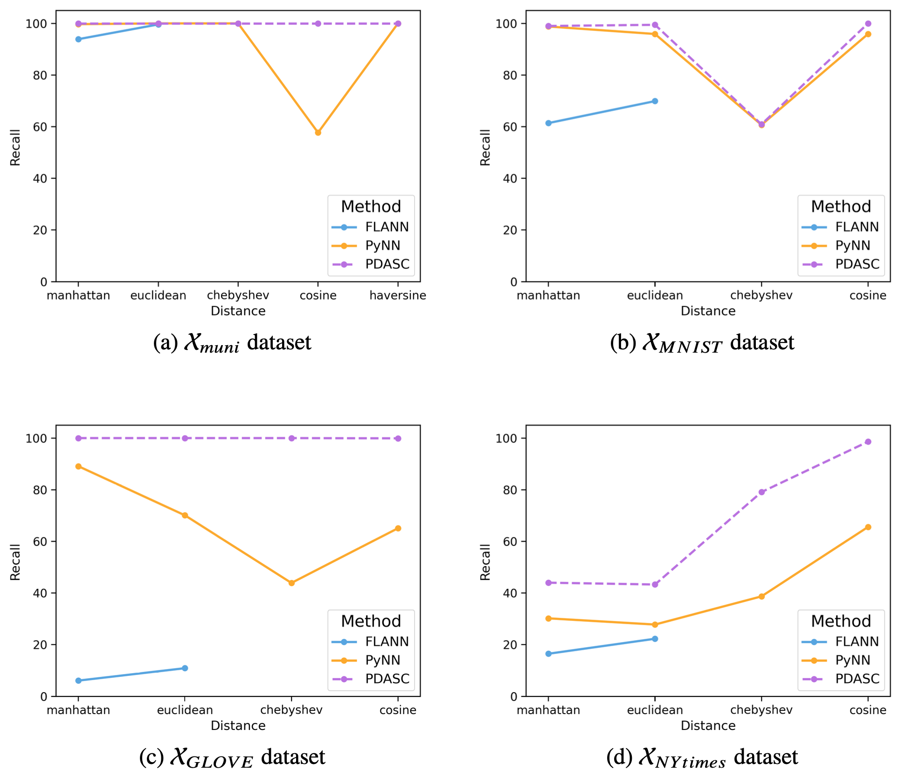

# PDASC - Parametrizable Distributed Approximate Similarity search with Clustering

<!-- * This project introduces PDASC (Parametrizable Distributed Approximate Similarity Search with Clustering), a parametrizable algorithm for ANN search that constructs a multilevel index using clustering techniques in an innovative way. By integrating clustering algorithms that inherently accommodate various distance functions, PDASC provides the adaptability needed to support arbitrary similarity measures.
-->
This project introduces PDASC (Parametrizable Distributed Approximate Similarity Search with Clustering), a parametrizable algorithm for approximate $k$-nearest neighbour search that combines an innovative multilevel index suitable for distributed environments with the flexibility to support arbitrary distance functions achieved through the integration of clustering algorithms that inherently accommodate them.

It constitutes a reliable ANN search method for large, high-dimensional datasets that cannot feasibly be processed on a single machine, as well as for those where selecting the most appropriate distance function is often non-trivial.

<!-- * For further detail, please refer to the associated publication. -->

## Summary of features
__Scalable and Distributed__

PDASC implements an advanced multilevel indexing structure suitable for large, 
high-dimensional datasets, typically stored in distributed systems.

It operates through two stages
* The **Multilevel Structure Algorithm (MSA)** implements a bottom-up approach to construct a multilevel index structure suitable for distributed and scalable data indexing by employing clustering algorithms in an innovative way. 
* The **Neighbors Search Algorithm (NSA)** leverages the multilevel index structure generated by MSA to efficiently identify the $k$-nearest neighbours of a given query point $(q)$.

__Arbitrary Distances Support__

Although the only requirement for the clustering algorithm used to construct the index is that it partitions the data space into Voronoi regions and generates a representative prototype for each, PDASC's ability to support multiple distance functions is achieved by the integration of clustering algorithms in the index-building process which inherently accommodate them.

### Clustering Algorithms Supported:

| Algorithm     | Implementation                      | Supported Distances                                         |
|---------------|-------------------------------------|-------------------------------------------------------------|
| **k-means**   | `sklearn`: `sklearn.cluster.KMeans` | Euclidean                                                   |
| **k-medoids** | `kmedoids`: `kmedoids.fasterpam`    | cityblock, cosine, euclidean, l1, l2, manhattan, braycurtis, canberra, chebyshev, correlation, dice, hamming, jaccard, kulsinski, mahalanobis, minkowski, rogerstanimoto, russellrao, seuclidean, sokalmichener, sokalsneath, sqeuclidean, yule |

## Experimental Evaluation
A comprehensive evaluation of PDASC is presented through a series of experiments. In this study, $k$-medoids has been used due to its compatibility with a wide range of distances.

### Datasets:
| Dataset                                                       | Label       | N         | Dimensionality | High Sparsity | Data Type  | 
|---------------------------------------------------------------|-------------|-----------|----------------|---------------|------------|
| [**Municipalities**](https://doi.org/10.5281/zenodo.12759082) | X_muni      | 8,130     | 2              | No            | Geospatial |
| [**MNIST**](https://doi.org/10.5281/zenodo.12759284)          | X_MNIST     | 69,000    | 784            | Yes           | Image      |
| [**GLOVE**](https://doi.org/10.5281/zenodo.12759356)          | X_GLOVE     | 1,000,000 | 100            | No            | Text       |
| [**NYtimes**](https://doi.org/10.5281/zenodo.12760693)        | X_NYtimes   | 290,000   | 256            | No            | Text       |

### Distance Functions Employed:

| Distance      | API         | Equation                                                                                                                                                                                                                                                                                                                   |
|---------------|-------------|----------------------------------------------------------------------------------------------------------------------------------------------------------------------------------------------------------------------------------------------------------------------------------------------------------------------------|
| **Euclidean** | `euclidean` |                                                                                                                                                  |
| **Manhattan** | `manhattan` |                                                                                                                                                                          |
| **Chebyshev** | `chebyshev` |                                                                                                                                                                                              |
| **Minkowski** | `minkowski` |                                                                              |
| **Cosine**    | `cosine`    |  |
| **Haversine** | `haversine` |  |

### Approximate Algorithms Comparision:
PDASC performance is compared with the results obtained using two robust algorithms, PyNN and FLANN, which differ in their index construction strategies but are renowned for their scalability in approximate similarity searches on large datasets.
* __PyNNDescent__  a Python-based implementation of the NNDescent algorithm that efficiently performs nearest neighbour searches by building a graph-based index connecting each data point to its approximate nearest neighbours. 
* __FLANN__ an efficient, tree-based method that applies random projection and hierarchical partitioning to create index structures that accelerate search operations. 

### Experimental results
For each dataset, a pointplot illustrates the recall of three different algorithms across various distance metrics (Manhattan, Euclidean, Chebyshev, Cosine & Haversine) in approximate $10$ - nearest neighbor search.

As shown by these pointplots, PDASC parametrised with the $k$-medoids clustering algorithm, consistently outperforms alternative indexing methods across all distance functions considered in our study.

These results not only validate PDASC as a reliable ANN search method for large, high-dimensional datasets that cannot feasibly be processed on a single machine and for those where selecting the optimal distance function is non-trivial, but also supports the core hypothesis of our research: employing distance functions beyond the Euclidean metric can yield superior results for approximate nearest-neighbour queries, depending on the dataset's specific characteristics.

## API description
This appendix is a guide to the usage of the PDASC Experiments Launcher and Benchmarking tool. Both are designed to facilitate the execution of approximate k-Nearest Neighbours searches by using the proposed method but also several SOTA related algorithms, then evaluating its performance on different contexts.

### Experiments Launcher
The `experiments_launcher.py` script facilitates the execution of the experiments whose parameters are described in configuration files (.ini). 

#### Usage:  
The script expects two arguments:
- Experiment: The name of the dataset whose experiments should be launched or a single .ini configuration file.
- Optional Filters: Optional filters to apply to the configuration files (if a directory is provided). 
`python3 -m benchmarks.experiments_launcher <dataset_name_or_ini_file> [optional_filters]`

#### Examples:  
- To run an experiment using a single .ini file: 
`python3 -m benchmarks.experiments_launcher test_knn_NYtimes_10_chebyshev_PDASC_tg1000_nc500_r30_kmedoids_fastkmedoids.ini`
- To run experiments for a dataset with optional filters: 
`python3 -m benchmarks.experiments_launcher NYtimes chebyshev PDASC`

### Performance Benchmarking
The `performance_benchmark.py` script facilitates the the performance evaluation of these experiments.

#### Usage:  
The script expects two arguments:
- Dataset: The name of the dataset whose experiments want to be benchmarked.
- Optional Filters: Optional filters to only show info about the desired experiments.
`python3 -m benchmarks.performance_benchmark <dataset_name> [optional_filters]`

#### Examples:  
- To benchmark experiments for a dataset: 
`python3 -m benchmarks.performance_benchmark NYtimes`

- To benchmark experiments for a dataset with optional filters: 
`python3 -m benchmarks.performance_benchmark NYtimes chebyshev PDASC`

## References

- **A parametrizable algorithm for distributed approximate similarity search with arbitrary distances**. Elena Garcia-Morato, Maria Jesus Algar, Cesar Alfaro, Felipe Ortega, Javier Gomez, Javier M. Moguerza. [arXiv:2405.13795](https://arxiv.org/abs/2405.13795)