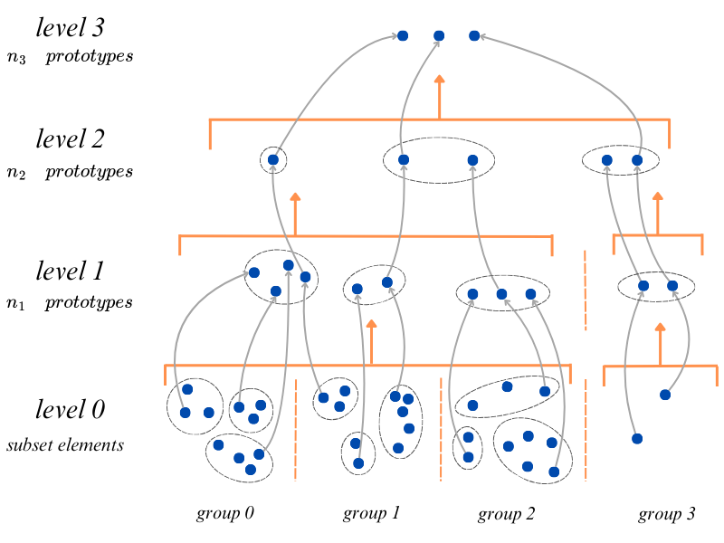
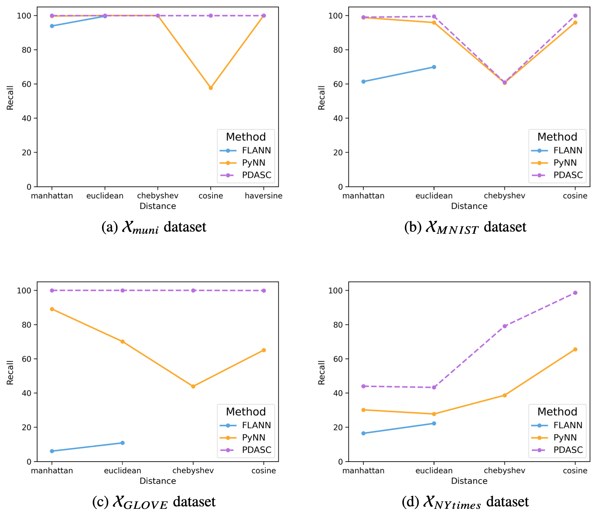
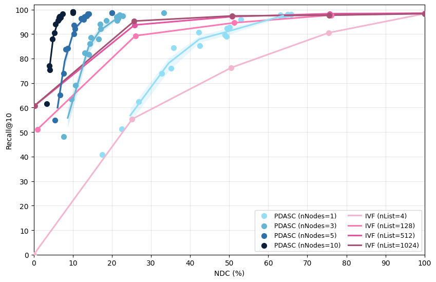

<!--<h1 align="center"> PDASC</h1>
-->

      
    

<!-- * This project introduces PDASC (Parametrizable Distributed Approximate Similarity Search with Clustering), a parametrizable algorithm for ANN search that constructs a multilevel index using clustering techniques in an innovative way. By integrating clustering algorithms that inherently accommodate various distance functions, PDASC provides the adaptability needed to support arbitrary similarity measures.
-->
<!-- * This project introduces PDASC (Parametrizable Distributed Approximate Similarity Search with Clustering) a fully distributable ANN algorithm designed to operate under a broad set of distance functions beyond conventional metric settings. The method applies established clustering techniques in a tailored and structurally oriented manner to build a hierarchical index aimed at mitigating several practical consequences of the curse of dimensionality while accommodating diverse notions of dissimilarity.
-->
This work introduces PDASC (Parametrizable Distributed Approximate Similarity Search with Clustering), a distributed ANN search algorithm whose index design simultaneously enables support for arbitrary dissimilarity functions and efficient deployment in distributed, storage-aware environments. 
By relying on a hierarchical clustering-based structure that does not assume specific distance properties, PDASC naturally accommodates non-metric and domain-specific similarities while allowing both indexing and search to be partitioned across multiple computing nodes with a compact per-node memory footprint
For further detail, please refer to the associated publication.

*Figure 1: Workflow of index construction on a single node.*

## Summary of features
__Scalable and Distributed__

PDASC implements an advanced multilevel index structure suitable for large, 
high-dimensional datasets, typically stored in distributed systems.

It operates through two stages
* The **Multilevel Structure Algorithm (MSA)** implements a bottom-up approach to construct a multilevel index structure suitable for distributed and scalable data indexing by employing clustering algorithms in an innovative way. 
* The **Neighbors Search Algorithm (NSA)** leverages the multilevel index structure generated by MSA to efficiently identify the approximate $k$-nearest neighbours of a given query point $(q)$.

__Arbitrary Distances Support__

By relying on clustering methods compatible with several dissimilarity functions, PDASC can operate directly with non-metric and domain-specific distances, significantly extending its applicability across heterogeneous data.
In this context, the $k$-medoids algorithm  is utilised, as it supports a wide range of dissimilarity functions, making it suitable for scenarios involving non-Euclidean or domain-specific distances.
* __Example of Supported Distances__: cityblock, cosine, euclidean, l1, l2, manhattan, braycurtis, canberra, chebyshev, correlation, dice, hamming, jaccard, kulsinski, mahalanobis, minkowski, rogerstanimoto, russellrao, seuclidean, sokalmichener, sokalsneath, sqeuclidean, yule

<!-- 
### Clustering Algorithms Supported:
| Algorithm     | Implementation                      | Supported Distances                                         |
|---------------|-------------------------------------|-------------------------------------------------------------|
| **k-medoids** | `kmedoids`: `kmedoids.fasterpam`    | cityblock, cosine, euclidean, l1, l2, manhattan, braycurtis, canberra, chebyshev, correlation, dice, hamming, jaccard, kulsinski, mahalanobis, minkowski, rogerstanimoto, russellrao, seuclidean, sokalmichener, sokalsneath, sqeuclidean, yule |
| **k-means**   | `sklearn`: `sklearn.cluster.KMeans` | Euclidean                                                   | 
-->

## Experimental Evaluation

The effectiveness of the proposed method is validated through a three-fold evaluation: performance, memory-footprint and quality, in comparison with other approaches.  
- **Performance** is assessed by reporting the number of distance computations (NDC) required during the search.  
- **Memory-Footprint** is measured by the size of the index generated by each method in MB.
- **Quality** is evaluated through the recall obtained with respect to the ground-truth set of 10 nearest neighbours (Recall@10).  

### ANN Comparison:
The provided API allows the user to easily replicate the experiments and compare the performance of PDASC with a diverse set of state-of-the-art ANN algorithms, which differ in their index construction strategies and search methodologies:

* __PyNNDescent__: a graph-based algorithm that builds an approximate k-NN graph through stochastic descent, connecting each point to its neighbours in an iterative refinement process.  

* __HNSW-NMSLIB (Hierarchical Navigable Small World Graphs, Non-Metric Space Library)__: a graph-based method that constructs a hierarchical small-world graph to facilitate efficient approximate nearest neighbour searches, particularly in non-metric spaces.

* __HNSW-FAISS (Hierarchical Navigable Small World Graphs, FAISS)__: the FAISS implementation of HNSW, which builds a hierarchical small-world graph to enable efficient approximate nearest neighbour searches, optimized for high-dimensional data.

* __IVF (Inverted File Index, FAISS)__: a clustering-based method that partitions the dataset into Voronoi cells around centroids, restricting searches to the most relevant clusters.  

* __LSH (Locality-Sensitive Hashing, FAISS)__: a hashing-based technique that projects data into hash buckets using similarity-preserving functions, so that close points are likely to fall into the same bucket.  

* __Annoy__: a tree-based method that constructs multiple random projection trees to partition the data space, allowing for efficient nearest neighbour searches by traversing these trees.

### Datasets:
| Dataset                                                       | Label       | N         | Dimensionality | Distance  | Data Type  | 
|---------------------------------------------------------------|-------------|-----------|----------------|-----------|------------|
| [**Municipalities**](https://doi.org/10.5281/zenodo.12759082) | X_muni      | 8,130     | 2              | Haversine | Geospatial |
| [**MNIST**](https://doi.org/10.5281/zenodo.12759284)          | X_MNIST     | 69,000    | 784            | Euclidean | Image      |
| [**GLOVE**](https://doi.org/10.5281/zenodo.12759356)          | X_GLOVE     | 1,000,000 | 100            | Cosine    | Text       |
| [**NYtimes**](https://doi.org/10.5281/zenodo.12760693)        | X_NYtimes   | 290,000   | 256            | Cosine    | Text       |
| [**MovieLens-10M**](https://doi.org/10.5281/zenodo.12760711)  | X_MovieLens | 69,363    | 65,134         | Jaccard   | CSR        |
| [**Kosarak**](https://doi.org/10.5281/zenodo.12760741)        | X_Kosarak   | 27,983   | 74,962            | Jaccard   | CSR        |

### Distance Functions Employed:

| Distance      | API         | Equation                                                                                                                                                                                                                                                                                                                   |
|---------------|-------------|----------------------------------------------------------------------------------------------------------------------------------------------------------------------------------------------------------------------------------------------------------------------------------------------------------------------------|
| **Euclidean** | `euclidean` |                                                                                                                                                  |
| **Manhattan** | `manhattan` |                                                                                                                                                                          |
| **Chebyshev** | `chebyshev` |                                                                                                                                                                                              |
| **Minkowski** | `minkowski` |                                                                              |
| **Cosine**    | `cosine`    |  |
| **Haversine** | `haversine` |  |
| **Jaccard**   | `jaccard`   |  |

<!--
### Experimental results
For each dataset, a pointplot illustrates the recall of the targeted algorithms across various distance metrics (Manhattan, Euclidean, Chebyshev, Cosine & Haversine) in approximate $10$ - nearest neighbor search.

*Figure 2: Point plots illustrating the average recall of each ANN method - distance function combination for each dataset under study in 10-NN search experiments.*

As shown by these pointplots, PDASC parametrised with the $k$-medoids clustering algorithm, consistently outperforms alternative indexing methods across all distance functions considered in our study.

These results not only validate PDASC as a reliable ANN search method for large, high-dimensional datasets that cannot feasibly be processed on a single machine and for those where selecting the optimal distance function is non-trivial, but also supports the core hypothesis of our research: employing distance functions beyond the Euclidean metric can yield superior results for approximate nearest-neighbour queries, depending on the dataset's specific characteristics.
-->

### Experimental results
Empirical results across diverse datasets and distance functions demonstrate that PDASC consistently achieves competitive recall while requiring a smaller or comparable per-node index size than state-of-the-art ANN methods. When distance computations are explicitly measured, PDASC attains favourable accuracy–efficiency trade-offs without relying on GPUs, TPUs, or other specialised accelerators.

*Figure 2: Recall - NDC trade-off comparison of PDASC and IVF with the NYTimes dataset.*

Instructions for installing PDASC and conducting the experiments are available in the [Python Usage Documentation](docs/PythonUsage.md).

## References

- **A Memory-Efficient Distributed Algorithm for Approximate Nearest Neighbour Search with Arbitrary Distances**. Elena Garcia-Morato, Maria Jesus Algar, Cesar Alfaro, Felipe Ortega, Javier Gomez, Javier M. Moguerza. [arXiv:2405.13795](https://arxiv.org/abs/2405.13795)