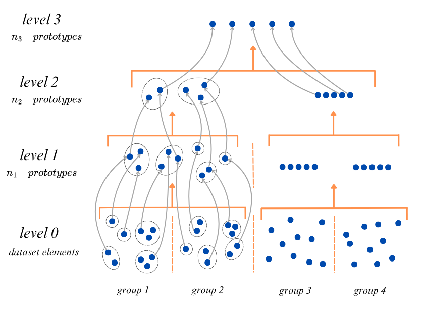

# PDASC - Parametrizable Distributed Approximate Similarity search with Clustering

<!-- * This project introduces PDASC (Parametrizable Distributed Approximate Similarity Search with Clustering), a parametrizable algorithm for ANN search that constructs a multilevel index using clustering techniques in an innovative way. By integrating clustering algorithms that inherently accommodate various distance functions, PDASC provides the adaptability needed to support arbitrary similarity measures.
-->
This project introduces PDASC (Parametrizable Distributed Approximate Similarity Search with Clustering), a distributed indexing algorithm specifically designed for ANN search with arbitrary distance functions. PDASC builds a hierarchical, multi-level index structure optimised for distributed environments, enabling scalable search capabilities even when non-metric or domain-specific distances are involved. This flexibility is achieved through the integration of clustering algorithms, such as $k$-medoids, that inherently support arbitrary dissimilarity measures.

It constitutes a reliable ANN search method for large, high-dimensional datasets that cannot feasibly be processed on a single machine, as well as for those where selecting the most appropriate distance function is often non-trivial.

<!-- * For further detail, please refer to the associated publication. -->

*Figure 1: Workflow of index construction on a single node.*

## Summary of features
__Scalable and Distributed__

PDASC implements an advanced multilevel index structure suitable for large, 
high-dimensional datasets, typically stored in distributed systems.

It operates through two stages
* The **Multilevel Structure Algorithm (MSA)** implements a bottom-up approach to construct a multilevel index structure suitable for distributed and scalable data indexing by employing clustering algorithms in an innovative way. 
* The **Neighbors Search Algorithm (NSA)** leverages the multilevel index structure generated by MSA to efficiently identify the approximate $k$-nearest neighbours (ANN) of a given query point $(q)$.

__Arbitrary Distances Support__

Although the only requirement for the clustering algorithm used to construct the index is that it partitions the data space into Voronoi regions and generates a representative prototype for each, PDASC's ability to support multiple distance functions is achieved by the integration of clustering algorithms in the index-building process which inherently accommodate them.

### Clustering Algorithms Supported:

| Algorithm     | Implementation                      | Supported Distances                                         |
|---------------|-------------------------------------|-------------------------------------------------------------|
| **k-means**   | `sklearn`: `sklearn.cluster.KMeans` | Euclidean                                                   |
| **k-medoids** | `kmedoids`: `kmedoids.fasterpam`    | cityblock, cosine, euclidean, l1, l2, manhattan, braycurtis, canberra, chebyshev, correlation, dice, hamming, jaccard, kulsinski, mahalanobis, minkowski, rogerstanimoto, russellrao, seuclidean, sokalmichener, sokalsneath, sqeuclidean, yule |

## Experimental Evaluation
A comprehensive evaluation of PDASC is presented through a series of experiments. In this study, $k$-medoids has been used due to its compatibility with a wide range of distances.

### Datasets:
| Dataset                                                       | Label       | N         | Dimensionality | High Sparsity | Data Type  | 
|---------------------------------------------------------------|-------------|-----------|----------------|---------------|------------|
| [**Municipalities**](https://doi.org/10.5281/zenodo.12759082) | X_muni      | 8,130     | 2              | No            | Geospatial |
| [**MNIST**](https://doi.org/10.5281/zenodo.12759284)          | X_MNIST     | 69,000    | 784            | Yes           | Image      |
| [**GLOVE**](https://doi.org/10.5281/zenodo.12759356)          | X_GLOVE     | 1,000,000 | 100            | No            | Text       |
| [**NYtimes**](https://doi.org/10.5281/zenodo.12760693)        | X_NYtimes   | 290,000   | 256            | No            | Text       |

### Distance Functions Employed:

| Distance      | API         | Equation                                                                                                                                                                                                                                                                                                                   |
|---------------|-------------|----------------------------------------------------------------------------------------------------------------------------------------------------------------------------------------------------------------------------------------------------------------------------------------------------------------------------|
| **Euclidean** | `euclidean` |                                                                                                                                                  |
| **Manhattan** | `manhattan` |                                                                                                                                                                          |
| **Chebyshev** | `chebyshev` |                                                                                                                                                                                              |
| **Minkowski** | `minkowski` |                                                                              |
| **Cosine**    | `cosine`    |  |
| **Haversine** | `haversine` |  |

### Approximate Algorithms Comparision:
PDASC performance is compared with the results obtained using two robust algorithms, PyNN and FLANN, which differ in their index construction strategies but are renowned for their scalability in approximate similarity searches on large datasets.
* __PyNNDescent__  a Python-based implementation of the NNDescent algorithm that efficiently performs nearest neighbour searches by building a graph-based index connecting each data point to its approximate nearest neighbours. 
<!-- * * __FLANN__ an efficient, tree-based method that applies random projection and hierarchical partitioning to create index structures that accelerate search operations. -->

### Experimental results
For each dataset, a pointplot illustrates the recall of the targeted algorithms across various distance metrics (Manhattan, Euclidean, Chebyshev, Cosine & Haversine) in approximate $10$ - nearest neighbor search.

*Figure 2: Point plots illustrating the average recall of each ANN method - distance function combination for each dataset under study in 10-NN search experiments.*

As shown by these pointplots, PDASC parametrised with the $k$-medoids clustering algorithm, consistently outperforms alternative indexing methods across all distance functions considered in our study.

These results not only validate PDASC as a reliable ANN search method for large, high-dimensional datasets that cannot feasibly be processed on a single machine and for those where selecting the optimal distance function is non-trivial, but also supports the core hypothesis of our research: employing distance functions beyond the Euclidean metric can yield superior results for approximate nearest-neighbour queries, depending on the dataset's specific characteristics.

## API description
This appendix is a guide to the usage of the PDASC Experiments Launcher and Benchmarking tool. Both are designed to facilitate the execution of approximate k-Nearest Neighbours searches by using the proposed method but also several SOTA related algorithms, then evaluating its performance on different contexts.

### Experiments Launcher
The `experiments_launcher.py` script facilitates the execution of the experiments whose parameters are described in configuration files (.ini). 

#### Usage:  
The script expects two arguments:
- Experiment: The name of the dataset whose experiments should be launched or a single .ini configuration file.
- Optional Filters: Optional filters to apply to the configuration files (if a directory is provided). 
`python3 -m ANN_Experiments.experiments_launcher <dataset_name_or_ini_file> [optional_filters]`

#### Configuration Files:
The configuration files are .ini files that contain the parameters for each experiment to be launched. The parameters include:
- `dataset`: The name of the dataset to be used.
- `k`: The number of ANN to be searched.
- `distance`: The distance function to be used.
- `method`: The method to be used for the search (e.g., `PDASC`, `PyNNDescent`).'

If the configuration file is for an experiment using PDASC, it should also include:
- `tg`: The size of each group to be clusterized when building the PDASC index.
- `nc`: The number of clusters to be used when clustering each group in the PDASC index.
- `n_nodes`: The number of data partitions to be used when building the PDASC index.
- `r`: The search radius to be used for narrowing down the search space in NSA.
- `algorithm`: The algorithm to be used for the search (e.g., `kmedoids`).
- `implementation`: The implementation of the algorithm to be used (e.g., `fasterpam`).

If the configuration file is for an experiment using other methods, it should include the initial parameters that are required to configure it.

#### Examples:  
- To run an experiment using a single .ini file: 
`python3 -m ANN_Experiments.experiments_launcher test_knn_NYtimes_10_chebyshev_PDASC_tg1000_nc500_r30_n10.ini`
- To run experiments for a dataset with optional filters: 
`python3 -m benchmarks.experiments_launcher NYtimes chebyshev PDASC`

### Performance Benchmarking
The `performance_benchmark.py` script facilitates the the performance evaluation of these experiments.

#### Usage:  
The script expects two arguments:
- Dataset: The name of the dataset whose experiments want to be benchmarked.
- Optional Filters: Optional filters to only show info about the desired experiments.
`python3 -m ANN_Experiments.benchmark.performance_benchmark <dataset_name> [optional_filters]`

#### Examples:  
- To benchmark experiments for a dataset: 
`python3 -m ANN_Experiments.benchmark.performance_benchmark NYtimes`

- To benchmark experiments for a dataset with optional filters: 
`python3 -m ANN_Experiments.benchmark.performance_benchmark NYtimes chebyshev PDASC`

### Distances Distribution's Generation
The `distances_distribution_generator.py` script allows generating different Distribution Functions to analyze the distribution of distances in a dataset. 
These distributions are generate both from a random sample of elements from the dataset and from the prototypes that compose a specific layer of the previously generated PDASC index.

#### Usage:
The script should be launched as follows:
`python3 -m dataset_analysis.distances_distribution_generator -<Distribution_Functions> "('dataset_name', 'distance_function')" -size <size> -nodes <n_nodes>`

The script expects three arguments:
- The Distribution Function(s) to be generated.
  - `-pdfsNN`: Perform kNN Distances CDF analysis with a tuple or a set of tuples.
  - `-pdfsPW`: Perform Pairwise Distances PDF analysis with a tuple or a set of tuples.
  - `-cdfsNN`: Perform kNN Distances CDF analysis with a tuple or set of tuples.
  - `-cdfsPW`: Perform Pairwise Distances CDF analysis with a tuple or a set of tuples.
  - `-cdfsNN_SS`: Perform kNN Distances CDF analysis for with varying sample sizes of a single dataset and distance function.
  - `-cdfsPW_SS`: Perform Pairwise Distances CDF analysis with varying sample sizes.
  
- `-size`: Sample size to use, as a percentage of the dataset (integer, e.g., `10` for 10%)
- `-nodes`: Number of distributed nodes composing the PDASC index.

**Note:** The arguments for the `-pdfsNN`, `-pdfsPW`, `-cdfsNN`,  `-cdfsPW`, `-cdfsNN_SS` and `-cdfsPW_SS` parameters must be provided as Python tuples, e.g., `("dataset_name", "distance_function")`.

#### Examples:
- kNN Distances PDF Analysis (`-pdfsNN`)
`python3 -m dataset_analysis.distances_distribution_generator -pdfsNN "('municipios', 'haversine')"  -size 10 -nodes 3`

- Pairwise Distances PDF Analysis (`-pdfsPW`)
`python3 -m dataset_analysis.distances_distribution_generator -pdfsPW "('municipios', 'haversine')"  -size 10 -nodes 3`

- kNN Distances CDF Analysis (`-cdfsNN`)
`python3 -m dataset_analysis.distances_distribution_generator -cdfsNN "('municipios', 'haversine')"  -size 10 -nodes 3`

- Pairwise Distances CDF Analysis (`-cdfsPW`)
`python3 -m dataset_analysis.distances_distribution_generator -cdfsPW "('municipios', 'haversine')"  -size 10 -nodes 3`

- kNN-CDF Analysis for different sample sizes(`-cdfsNN_SS`)
`python3 -m dataset_analysis.distances_distribution_generator -cdfsNN_SS "('municipios', 'haversine')" `

- Pairwise Distances CDF Analysis for different sample sizes (`-cdfsPW_SS`)
`python3 -m dataset_analysis.distances_distribution_generator -pdfsNN_SS "('municipios', 'haversine')" `

### Distances Distribution's Evaluation
The `distances_distribution_evaluation.py` script provides statistical analysis tools to compare distributions of pairwise distances in datasets using the Kolmogorov-Smirnov (KS) test and the Wasserstein distance. 
It is useful for evaluating how similar or different two distributions (a random sample of elements from the dataset and from the prototypes that compose a specific layer of the previously generated PDASC index) are.

#### Usage:
The script should be launched as follows:
`python3 -m dataset_analysis.distances_distribution_evaluation  -dataset <dataset_name> -dist <distance_function> -size <size> -nodes <n_nodes>`

The script expects four arguments:
- Dataset: The name of the dataset to process
- Distance Function: The distance function to be used for the analysis.
- `-size`: Sample size to use, as a percentage of the dataset (integer, e.g., `10` for 10%)
- `-nodes`: Number of distributed nodes composing the PDASC index.

#### Example
`python3 -m dataset_analysis.distances_distribution_generator -dataset MNIST -dist euclidean -size 10 -nodes 3`

#### Output
- Prints the KS statistic and its interpretation.
- Prints the p-value and its statistical significance.
- Prints the Wasserstein distance.

## References

- **A parametrizable algorithm for distributed approximate similarity search with arbitrary distances**. Elena Garcia-Morato, Maria Jesus Algar, Cesar Alfaro, Felipe Ortega, Javier Gomez, Javier M. Moguerza. [arXiv:2405.13795](https://arxiv.org/abs/2405.13795)